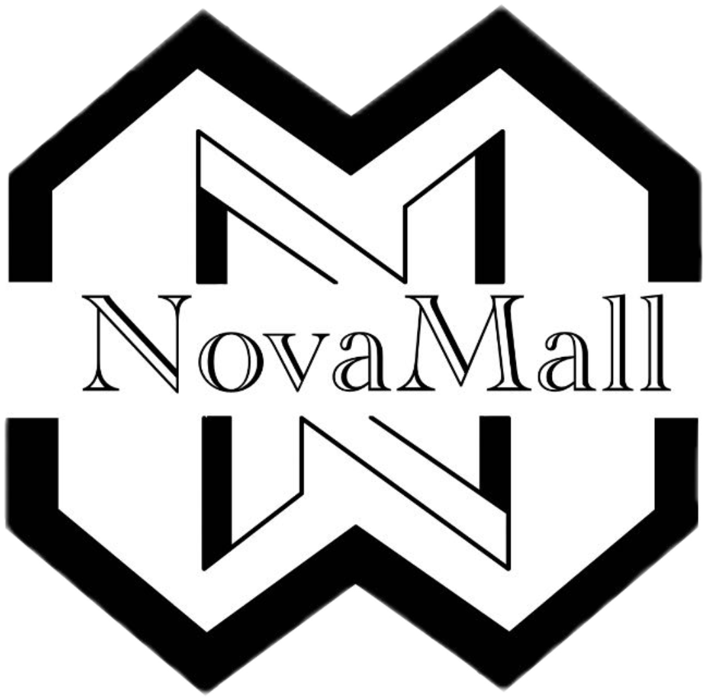

<!-- Improved compatibility of back to top link: See: https://github.com/othneildrew/Best-README-Template/pull/73 -->
<a name="readme-top"></a>
<!--
*** Thanks for checking out the Best-README-Template. If you have a suggestion
*** that would make this better, please fork the repo and create a pull request
*** or simply open an issue with the tag "enhancement".
*** Don't forget to give the project a star!
*** Thanks again! Now go create something AMAZING! :D
-->


<!-- PROJECT SHIELDS -->
<!--
*** I'm using markdown "reference style" links for readability.
*** Reference links are enclosed in brackets [ ] instead of parentheses ( ).
*** See the bottom of this document for the declaration of the reference variables
*** for contributors-url, forks-url, etc. This is an optional, concise syntax you may use.
*** https://www.markdownguide.org/basic-syntax/#reference-style-links
-->
[![Contributors][contributors-shield]][contributors-url]
[![Forks][forks-shield]][forks-url]
[![Stargazers][stars-shield]][stars-url]
[![Issues][issues-shield]][issues-url]


<!-- PROJECT LOGO -->
<br />
<div align="center">
  <a href="https://github.com/LCriAaUnN/NovaMall">
    
  </a>

<h3 align="center">NovaMall</h3>

  <p align="center">
    NovaMall is an innovative online shopping platform designed to provide users with a seamless and convenient shopping experience. Developed as the CSCI3100 course project, NovaMall offers a wide range of products across various categories, catering to the diverse needs and preferences of modern consumers.
    <br />
    <a href="https://github.com/LCriAaUnN/NovaMall"><strong>Explore the docs »</strong></a>
    <br />
    <br />
    <a href="https://github.com/LCriAaUnN/NovaMall">View Demo</a>
    ·
    <a href="https://github.com/LCriAaUnN/NovaMall/issues/new?labels=bug&template=bug-report---.md">Report Bug</a>
    ·
    <a href="https://github.com/LCriAaUnN/NovaMall/issues/new?labels=enhancement&template=feature-request---.md">Request Feature</a>
  </p>
</div>


<!-- TABLE OF CONTENTS -->
<details>
  <summary>Table of Contents</summary>
  <ol>
    <li>
      <a href="#about-the-project">About The Project</a>
      <ul>
        <li><a href="#built-with">Built With</a></li>
      </ul>
    </li>
    <li>
      <a href="#getting-started">Getting Started</a>
      <ul>
        <li><a href="#prerequisites">Prerequisites</a></li>
        <li><a href="#installation">Installation</a></li>
      </ul>
    </li>
    <li><a href="#usage">Usage</a></li>
    <li><a href="#roadmap">Roadmap</a></li>
    <li><a href="#contributing">Contributing</a></li>
    <li><a href="#contact">Contact</a></li>
    <li><a href="#acknowledgments">Acknowledgments</a></li>
  </ol>
</details>


<!-- ABOUT THE PROJECT -->
## About The Project

![Product Name Screen Shot][product-screenshot]

<h3>Key Features:</h3>
<ul>
  <li><strong>User Authentication and Profiles:</strong> NovaMall allows users to create personalized accounts, enabling them to manage their shopping activities efficiently. User profiles store essential information such as order history, preferences, and shipping details.</li>
  
  <li><strong>Product Catalog:</strong> The platform boasts an extensive product catalog featuring items ranging from electronics and fashion to home essentials and more. Users can browse through different categories and explore detailed product descriptions along with images.</li>
  
  <li><strong>Search and Filtering:</strong> NovaMall simplifies the shopping process with robust search and filtering functionalities. Users can quickly find specific products by entering keywords or utilize advanced filters to narrow down their options based on price, brand, and other parameters.</li>
  
  <li><strong>Shopping Cart and Checkout:</strong> Adding items to the cart is effortless, allowing users to collect desired products for purchase. The checkout process is streamlined, with secure payment gateways ensuring a safe and hassle-free transaction experience.</li>
  
  <li><strong>Order Tracking:</strong> Once an order is placed, users can track its status in real-time through the NovaMall platform. From processing to shipping and delivery, comprehensive order tracking enhances transparency and customer satisfaction.</li>
  
  <li><strong>Responsive Design:</strong> With a responsive design, NovaMall ensures a seamless browsing experience across various devices, including desktops, tablets, and smartphones. This flexibility allows users to shop anytime, anywhere, without compromising usability.</li>
</ul>

<p align="right">(<a href="#readme-top">back to top</a>)</p>


### Built With

* [![React][React.js]][React-url]
* [![Django][Django.com]][Django-url]
* [![Mysql][Mysql.com]][Mysql-url]

<p align="right">(<a href="#readme-top">back to top</a>)</p>


<!-- GETTING STARTED -->
## Getting Started

This is an example of how you may give instructions on setting up your project locally.
To get a local copy up and running follow these simple example steps.

### Prerequisites

This is an example of how to list things you need to use the software and how to install them.
* npm
  ```sh
  npm install npm@latest -g
  ```
* libraries 
  ```sh
  pip install -r requirements.txt
  ```
* mysql-client
  ```sh
  brew install mysql pkg-config
  pip install mysqlclient
  ```
### Installation

1. Clone the repo
   ```sh
   git clone https://github.com/LCriAaUnN/NovaMall.git
   ```
2. Database setting
    ```sh
    mysql -uroot -p
    create database NovaMall charset=utf8;
    mysql -uroot -p NovaMall < NovaMall/NovaMall.sql
    ```
3. Install npm
    ```sh
    npm install
    ```
<p align="right">(<a href="#readme-top">back to top</a>)</p>


<!-- USAGE EXAMPLES -->
## Usage
1. Run server
    ```sh
    python3 NovaMall/manage.py runserver
    cd UI\ design/
    npm start
    ```
2. Administrator Login</br>
  *See Doc Administrator.txt for account name & pwd*
<p align="right">(<a href="#readme-top">back to top</a>)</p>


<!-- CONTRIBUTING -->
## Contributing

Contributions are what make the open source community such an amazing place to learn, inspire, and create. Any contributions you make are **greatly appreciated**.

If you have a suggestion that would make this better, please fork the repo and create a pull request. You can also simply open an issue with the tag "enhancement".
Don't forget to give the project a star! Thanks again!

1. Fork the Project
2. Create your Feature Branch (`git checkout -b feature/AmazingFeature`)
3. Commit your Changes (`git commit -m 'Add some AmazingFeature'`)
4. Push to the Branch (`git push origin feature/AmazingFeature`)
5. Open a Pull Request

<p align="right">(<a href="#readme-top">back to top</a>)</p>


<!-- CONTACT -->
## Contact

Cameron - crliu002@gmail.com

Project Link: [https://github.com/LCriAaUnN/NovaMall](https://github.com/LCriAaUnN/NovaMall)

<p align="right">(<a href="#readme-top">back to top</a>)</p>


<!-- ACKNOWLEDGMENTS -->
## Acknowledgments
The NovaMall references the following projects.

* [Django-React-Full-Stack-App](https://github.com/techwithtim/Django-React-Full-Stack-App)
* [Best-README-Template](https://github.com/othneildrew/Best-README-Template)

<p align="right">(<a href="#readme-top">back to top</a>)</p>


<!-- MARKDOWN LINKS & IMAGES -->
<!-- https://www.markdownguide.org/basic-syntax/#reference-style-links -->
[contributors-shield]: https://img.shields.io/github/contributors/LCriAaUnN/NovaMall.svg?style=for-the-badge
[contributors-url]: https://github.com/LCriAaUnN/NovaMall/graphs/contributors
[forks-shield]: https://img.shields.io/github/forks/LCriAaUnN/NovaMall.svg?style=for-the-badge
[forks-url]: https://github.com/LCriAaUnN/NovaMall/network/members
[stars-shield]: https://img.shields.io/github/stars/LCriAaUnN/NovaMall.svg?style=for-the-badge
[stars-url]: https://github.com/LCriAaUnN/NovaMall/stargazers
[issues-shield]: https://img.shields.io/github/issues/LCriAaUnN/NovaMall.svg?style=for-the-badge
[issues-url]: https://github.com/LCriAaUnN/NovaMall/issues
[product-screenshot]: ./screenshot.png
[Next.js]: https://img.shields.io/badge/next.js-000000?style=for-the-badge&logo=nextdotjs&logoColor=white
[Next-url]: https://nextjs.org/
[React.js]: https://img.shields.io/badge/React-20232A?style=for-the-badge&logo=react&logoColor=61DAFB
[React-url]: https://reactjs.org/
[Vue.js]: https://img.shields.io/badge/Vue.js-35495E?style=for-the-badge&logo=vuedotjs&logoColor=4FC08D
[Vue-url]: https://vuejs.org/
[Angular.io]: https://img.shields.io/badge/Angular-DD0031?style=for-the-badge&logo=angular&logoColor=white
[Angular-url]: https://angular.io/
[Svelte.dev]: https://img.shields.io/badge/Svelte-4A4A55?style=for-the-badge&logo=svelte&logoColor=FF3E00
[Svelte-url]: https://svelte.dev/
[Laravel.com]: https://img.shields.io/badge/Laravel-FF2D20?style=for-the-badge&logo=laravel&logoColor=white
[Laravel-url]: https://laravel.com
[Bootstrap.com]: https://img.shields.io/badge/Bootstrap-563D7C?style=for-the-badge&logo=bootstrap&logoColor=white
[Bootstrap-url]: https://getbootstrap.com
[JQuery.com]: https://img.shields.io/badge/jQuery-0769AD?style=for-the-badge&logo=jquery&logoColor=white
[JQuery-url]: https://jquery.com 
[Mysql-url]:https://www.mysql.com/
[Django-url]:https://www.djangoproject.com/
[Mysql.com]: https://img.shields.io/badge/Mysql-563D7C?style=for-the-badge&logo=Mysql&logoColor=white
[Django.com]: https://img.shields.io/badge/Django-000000?style=for-the-badge&logo=Django&logoColor=white
